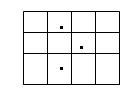
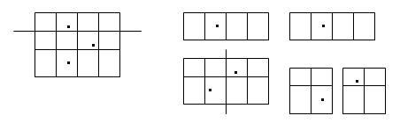
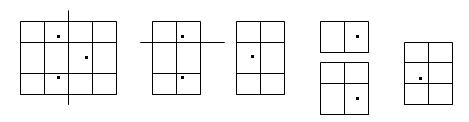

---
layout: post
category : 算法
tagline: "简单动规"
tags : [C++,算法,动态规划]
---  


# UVA 1629 [动态规划]    

> Problem Description     
> A rectangular cake with a grid of m*n unit squares on its top needs to be sliced into pieces. Several cherries are scattered on the top of the cake with at most one cherry on a unit square. The slicing should follow the rules below:         
> 1. each piece is rectangular or square;     
> 2. each cutting edge is straight and along a grid line;    
> 3. each piece has only one cherry on it;    
> 4. each cut must split the cake you currently cut two separate parts    
>     
> For example, assume that the cake has a grid of 3*4 unit squares on its top, and there are three cherries on the top, as shown in the figure below.    
>     
> One allowable slicing is as follows.    
>    
> For this way of slicing , the total length of the cutting edges is 2+4=6.
Another way of slicing is     
>    
> In this case, the total length of the cutting edges is 3+2=5.
> 
> Give the shape of the cake and the scatter of the cherries , you are supposed to find    
> out the least total length of the cutting edges.    
>
> Input    
> The input file contains multiple test cases. For each test case:    
> The first line contains three integers , n, m and k (1≤n, m≤20), where n*m is the size of the unit square with a cherry on it . The two integers show respectively the row number and the column number of the unit square in the grid .     
> All integers in each line should be separated by blanks.    
>  
> Output    
> Output an integer indicating the least total length of the cutting edges.     
>
> Sample Input    
> 3 4 3 1 2 2 3 3 2     
>  
> Sample Output     
> Case 1: 5    

## 解析
乍一看就明白这题该用动规，整个求解的过程也相对容易，这里只简单论述解体方法：
    
对整个图求最优解即为对**对所有切割一次后得到的两部分求解，并取其代价的最小值**，即
1. 遍历所有将图M分割成两部分的情况(共n种)，记每种分割情况下，分割后的两个子图求最优代价[步骤2]为Ak,Bk(k取1到n)，记这种情况下总分割代价为`Ck=Ak+Bk+W`(k取1到n,W为本次分割的代价)，对数组`Ck`求最小值，即为最优解
2. 对分割后的图A,B使用`1`所描述的方法，求得其最优解

## 示例代码 (没有去OJ测试[笑]，仅供参考)

	#include <iostream>
	#include <memory.h>
	#include <memory>
	
	using namespace std;
	
	int cake[21][21];
	int m,n,k;
	
	int min_cutting_edges(int x,int y,int w,int h){
		int c = 0;      // Number of current squares's cherries
		int x_c[w];     // Number of column x+w's cherries
		int y_c[h];     // Number of row y+h's cherries
		for(int i=0;i<w;i++)
			x_c[i] = 0;
		for(int i=0;i<h;i++)
			y_c[i] = 0;
		for(int i=x;i<x+w;i++){
			for(int t=y;t<y+h;t++){
				if(cake[i][t]){
					++c;		// 	总樱桃个数
					++x_c[i-x]; // 	这一列存在的樱桃个数
					++y_c[t-y];	//	这一行存在的樱桃个数
				}
			}
		}
	
		if (c <= 1)		//	只存在一个或者不存在樱桃时不进行分割（代价为0）
			return 0;
	
		int c1 = 0;
		int min_solution = 1000;
		int current_solution = 1000;
		for(int i=0;i<w;i++){		// 遍历所有可能的纵向切割
			current_solution = 1000;
			c1 += x_c[i];
			if(c1 == c)				// 当右侧不再存在樱桃时
				break;
			if(c1 > 0){
				current_solution = h;									//	本次分割代价
				current_solution += min_cutting_edges(x+i+1,y,w-i-1,h);	// 右子图求最优解
				current_solution += min_cutting_edges(x,y,i+1,h);		// 左子图求最优解
				if(current_solution < min_solution)
					min_solution = current_solution;
			}
		}
		c1 = 0;
		for(int i=0;i<h;i++){		// 遍历所有可能的横向切割
			current_solution = 1000;
			c1 += y_c[i];
			if(c1 == c)				//	当下侧不再存在樱桃时
				break;
			if(c1 > 0){				
				current_solution = w;									// 本次分割代价
				current_solution += min_cutting_edges(x,y,w,i+1);		//	上子图求最优解
				current_solution += min_cutting_edges(x,y+i+1,w,h-i-1);	//	下子图求最优解
				if(current_solution < min_solution)
					min_solution = current_solution;
			}
		}
		return min_solution;
	}
	
	int main(){
		for(int i=0;i<21;i++)
			for(int t=0;t<21;t++)
				cake[i][t] = 0;
		int x,y;
		int c = 0;
		while(scanf("%d %d %d",&n,&m,&k)!=EOF){
			for(int i=0;i<k;i++){
				scanf("%d %d",&y,&x);
				cake[x][y] = 1;
			}
			++c;
			cout << "Case "<< c << ": " << min_cutting_edges(1,1,n,m) << endl;
		}
		return 0;
	}
